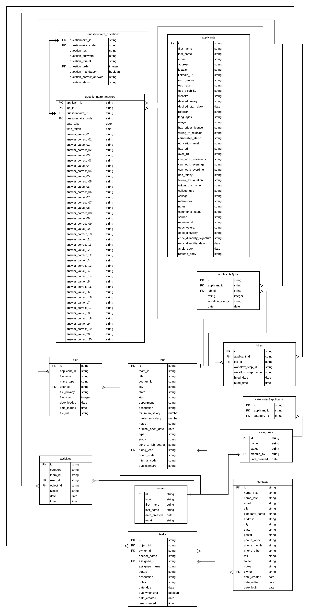

# jazzhr_tap

## Quick start

1. Virtual environment
- Create a virtual environment

    ``` shell script
    python3 -m venv <environment_name>
    ````

- Active virtual environment

    ``` shell script
    source <environment_name>/bin/activate
    ````


2. Install
- Clone this project

    ``` shell script
    git clone https://github.com/oscarrussi/jazzhr_tap.git
    ````

- In the jazzhr_tap/jazzhr_reources/schemas folder, create a keys.json file and add you key:

    ```javascript
    {"jazzhr_key": "<your_key>"}
    ```

- In the jazzhr_tap folder, install the package

    ``` shell script
    pip install .
    ````

##  Entity relation diagram


